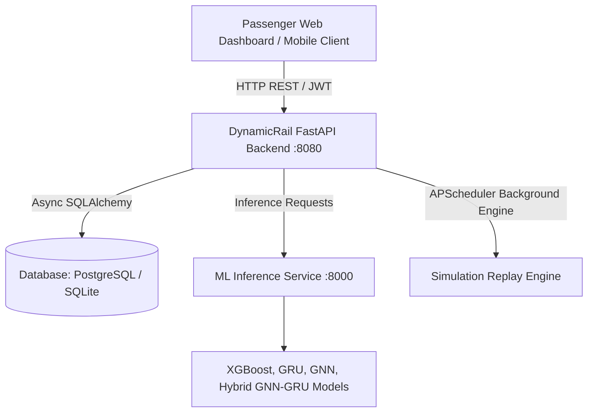

# DynamicRail — Dynamic Forecast of Expected Time of Arrival (ETA)

**Smart India Hackathon 2026 | Problem Statement: SIH26028**

DynamicRail is a production-quality, AI-driven train delay prediction and real-time ETA forecasting system for Indian Railways. It integrates a **FastAPI backend**, an **advanced ML inference engine (XGBoost + GRU + GNN + Hybrid GNN-GRU)**, a **real-time simulation replay engine**, and an **interactive passenger intelligence web interface**.

---

## 🚀 Key Features

1. **Dynamic ETA & Delay Forecast**:
   - Predicts additional delay and total delay using trained XGBoost and Neural models.
   - Calculates dynamic uncertainty intervals (ETA Lower / Upper).
   - Generates automated root-cause explanations with confidence scores.
   - Computes downstream delay propagation risk (`LOW`, `MEDIUM`, `HIGH`).

2. **Smart Alarms & Notifications**:
   - Dynamic wake-up alarms that automatically adjust based on real-time ETA changes.
   - Configurable delay change threshold alerts (e.g. notify if delay increases by > 5 mins).
   - Approaching destination proximity alerts.

3. **Multi-Model Intelligence & Chatbot**:
   - Interactive Railway AI Assistant (`/api/v1/predictions/chat`) supporting multiple Indian languages (Hindi, Marathi, Tamil, Bengali, Telugu, Gujarati, Kannada, Malayalam, Odia, Punjabi, English).
   - Live Weather and Google Directions integration.

4. **Realistic Simulation Engine**:
   - Replays 30,000+ sequential positions across 995 trains and 30 major stations.
   - Live virtual clock with continuous state updates.
   - Graceful degradation mode when ML service is offline (serves cached / estimated state with stale warning).

---

## 🏗️ System Architecture



---

## ⚡ Quick Start

### Option A: 1-Click Launch (Windows)
Double-click `start_all.bat` in the project root. It will:
1. Start the ML Service on port `8000`
2. Start the Backend API Server on port `8080`
3. Launch `frontend.html` in your browser

### Option B: Manual Startup

#### 1. Setup Environment
```bash
# Install backend and ML dependencies
pip install fastapi uvicorn[standard] sqlalchemy alembic aiosqlite asyncpg psycopg2-binary pydantic pydantic-settings python-jose[cryptography] passlib[bcrypt] httpx python-multipart pandas numpy apscheduler pytest pytest-asyncio python-dotenv python-dateutil structlog xgboost scikit-learn torch joblib requests
```

#### 2. Initialize Database & Seed Data
```bash
cd backend
python scripts/setup_all.py
```

#### 3. Start the ML Inference Engine (Port 8000)
```bash
cd DynamicRail_Complete_ML
uvicorn api:app --host 0.0.0.0 --port 8000 --reload
```

#### 4. Start the Backend Server (Port 8080)
```bash
cd backend
uvicorn app.main:app --host 0.0.0.0 --port 8080 --reload
```

#### 5. Open the Passenger Dashboard
Open `frontend.html` in any web browser or serve via Live Server.

---

## 📡 API Endpoints Reference

### Health & Replay Status
- `GET /health` — Backend and database status
- `GET /health/ml` — ML service connectivity and loaded model inventory
- `GET /health/replay` — Replay engine status, virtual clock, active train count

### Authentication
- `POST /api/v1/auth/register` — Create passenger account
- `POST /api/v1/auth/login` — Authenticate and receive JWT Bearer token
- `GET /api/v1/auth/me` — Current user profile and preferences

### Trains & Predictions
- `GET /api/v1/trains?query=&page=1&limit=20` — Search and list trains
- `GET /api/v1/trains/{train_id}` — Train details with route stations
- `GET /api/v1/trains/{train_id}/status` — Live train running status with ML ETA prediction
- `POST /api/v1/trains/{train_id}/predict` — On-demand prediction trigger

### Passenger Services
- `GET /api/v1/tracking` — List user's tracked trains
- `POST /api/v1/tracking` — Track a train
- `DELETE /api/v1/tracking/{train_id}` — Untrack train
- `GET /api/v1/alarms` — List smart alarms
- `POST /api/v1/alarms` — Set dynamic smart alarm
- `DELETE /api/v1/alarms/{alarm_id}` — Delete smart alarm
- `GET /api/v1/notifications` — Passenger notification feed
- `POST /api/v1/predictions/chat` — Railway AI assistant query

---

## 🧪 Testing

Run all backend unit, API, and ML integration tests:
```bash
cd backend
pytest tests/ -v
```

---

## 🏆 SIH Presentation Demonstration Guide

1. **Search Train**: Enter `12951` or `Express` to view real-time train listing.
2. **Live Forecast**: Click a train card to inspect live delay, ETA window, root-cause delay reasoning, and downstream risk propagation.
3. **Smart Alarm**: Set an alarm for 30 minutes before destination ETA; notice how the backend dynamically shifts the trigger if train delays fluctuate.
4. **AI Assistant**: Ask questions like *"Why is my train delayed?"* or switch languages to Hindi/regional languages.
5. **Degraded Mode Resilience**: Stop the ML engine (`Ctrl+C` in ML terminal) and refresh; observe how the system seamlessly serves fallback estimations with a degraded mode badge rather than failing.
